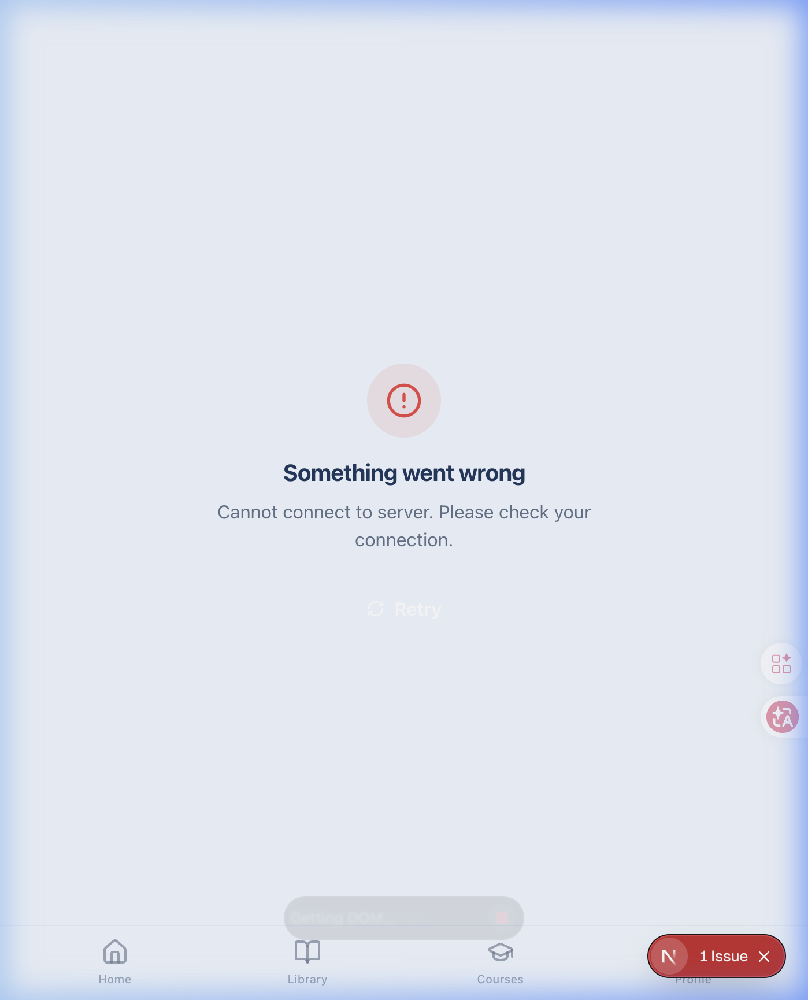

# Walkthrough: Robust Offline and Server Error Handling (Issue #50)

## ✅ งานที่ทำเสร็จใน Issue นี้
ได้ทำการเพิ่มระบบจัดการ Error เพื่อแสดงหน้า UI ให้ผู้ใช้รับทราบอย่างชัดเจนเมื่อมีปัญหาเกี่ยวกับการเชื่อมต่อ (Network) หรือตัวเซิร์ฟเวอร์ (Server Error) ในทั้ง 3 แพลตฟอร์ม

### 1. Web

- สร้าง component `ErrorState.tsx` สำหรับแสดงข้อความ Error พร้อมปุ่ม "Retry"
- นำ `ErrorState` ไปแสดงผลบนหน้า `Dashboard` และ `Weekly Practices` หากการโหลดข้อมูลตัวแรก (Initial Load) ล้มเหลว
- การกระทำย่อยเช่น การติ๊ก Checkbox (Toggle Practice) หากล้มเหลว จะแสดง Toast Error แจ้งเตือนผู้ใช้ผ่านไลบรารี `sonner` ควบคู่กับการ Revert state คืนให้เหมือนเดิม

### 2. Android
- ป้องกันการที่ `NetworkWisdomGardenRepository` กลืน Exception หายไปโดยการโยน (Throw) ออกมาให้ `WisdomGardenViewModel` จัดการต่อแทน
- เพิ่มฟิลด์ `error: String?` เข้าไปใน Data Class สเตตของ UI เพื่อผูกกับ State
- สร้าง Composable Component `ErrorState` แถบรวมข้อความแจ้งเตือน Error และปุ่ม "Retry"
- แก้ไขให้ `WisdomGardenScreen` นำ `ErrorState` ไปแสดงผล หากข้อมูลหลักโหลดไม่ขึ้น
- เมื่อคำขอเล็กๆ อย่าง Checkbox Toggle เกิดขัดข้อง จะแสดง Snackbar/Toast บอกผู้ใช้
- อัปเดตและเขียน `WisdomGardenViewModelTest` รองรับการทดสอบ Exception จาก Repository

### 3. iOS
- เปลี่ยนจากการที่ `NetworkWisdomGardenRepository` เข้าถึงข้อมูลดัมมี่เปลี่ยนเป็น Throw Error แทนเพื่อให้สอดคล้องกับพฤติกรรมที่ควรเป็นจริงๆ
- อัปเดต Published variables อย่าง `isLoading`, `errorMessage` และ `toastMessage` บน `WisdomGardenViewModel`
- เพิ่ม `ErrorStateView.swift` เพื่อแสดง Message พร้อมปุ่มโหลดใหม่
- หากเกิดข้อผิดพลาดในการโหลดข้อมูลหลักใน `WisdomGardenView` จะส่งผลให้หน้าจอ `ErrorStateView` ปรากฏขึ้นมาแทนที่แบบเต็มตัว
- ใช้งาน `ToastMessage Overlay` บนหน้าจอหลักเพื่อแจ้งผลที่ทำไม่สำเร็จในการติ๊ก Checkbox แล้วรอสักระยะก็จะหายไปเอง (พร้อมการ Revert state กลับ)
- เพิ่มเคสในระบบทดสอบ Unit Test (`WisdomGardenViewModelTests`) เพื่อครอบคลุมการ Handle error และ optimistic updates

## 🧪 Verification Plan (คำแนะนำการทดสอบ)
สำหรับประเด็นที่เกี่ยวข้องกับการทดสอบ Network / Offline แนะนำให้ทดสอบบนสภาพแวดล้อมจำลองจริงดังนี้:
1. **ปิดเน็ต**: ตัดการเชื่อมต่อของอุปกรณ์ (Airplane mode / Turn off WiFi / ปิดเซิร์ฟเวอร์)
2. **เข้าแอป**: เปิดเข้าสู่แอปพลิเคชัน จะต้องเห็นหน้า `ErrorState` ปรากฏพร้อมข้อความแจ้งเตือนปัญหาสัญญาณอินเทอร์เน็ต
3. **ลอง Retry**: ในขณะที่เห็นหน้า Error ลองกดเปิดเน็ตอีกครั้ง แล้วแตะที่ปุ่ม Retry -> แอปพลิเคชันสมควรโหลดข้อมูลได้สำเร็จ
4. **Offline Toggle Action**: ในขณะที่แอปเห็นข้อมูลปกติ ลองตั้งใจปิดอินเทอร์เน็ต แล้วกด Checkbox หน้า Practices -> แอปควรแสดง Toast/Snackbar แจ้งเตือนข้อผิดพลาดขึ้นมา และสถานะของ Checkbox ควรจะเด้งกลับคืนเป็นค่าเดิม (Optimistic Update Reversion)

*ระบบได้เขียนโค้ดและ Unit test ทั้งหมดเสร็จสมบูรณ์แล้ว คุณสามารถตรวจสอบหรือลองรันบนแต่ละแพลตฟอร์มได้เลย* (หมายเหตุ: แนะนำให้รัน Android ผ่าน Android Studio ด้วยตนเองแทนที่จะใช้ Luma/Command line เพื่อเลี่ยงปัญหา Error "25.0.1" จาก Gradle Daemon ของคุณ)
